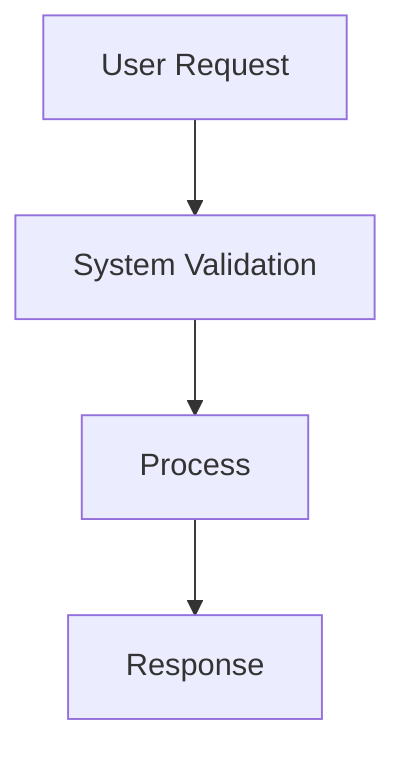
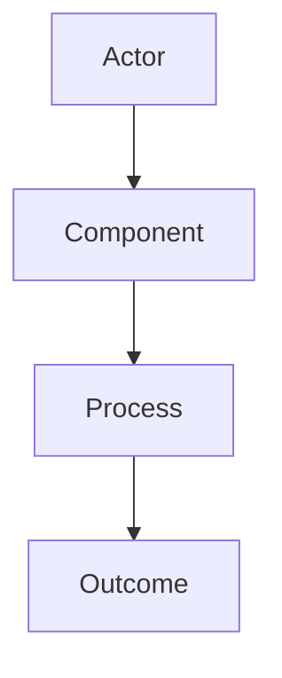
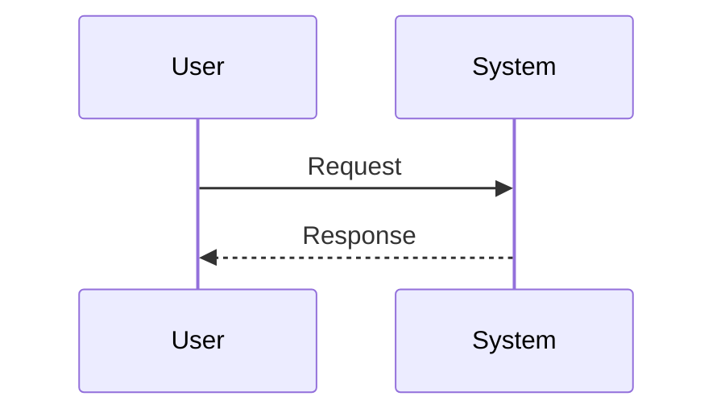
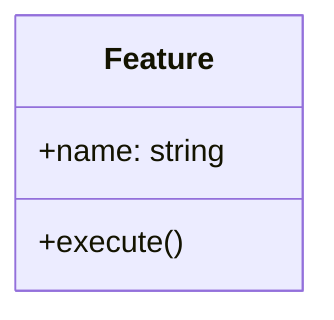

# Create a New Specification

Create a new software specification for the requested feature, change, or initiative.

## Target location

- Create the new file in `.specs/backlog/` at the repository root.
- Use a clear, descriptive filename in kebab-case, such as `user-authentication-flow.spec.md`.
- If the request is ambiguous, choose a sensible name and note assumptions in the file.

## Required content

Each spec must include the following sections:

1. Title
2. Description
   - Explain the problem, goal, context, and scope.
   - Describe the business value and expected behavior.
3. Acceptance Criteria
   - Provide a checklist using Markdown checkboxes: `- [ ]`.
   - Make the criteria testable and specific.
4. Diagrams
   - Include Mermaid diagrams that explain flow and structure.
   - Use at least one of the following, and add more when useful:
     - block diagram
     - UML sequence diagram
     - UML class diagram
     - components diagram
     - flowchart
     - state diagram
   - Keep diagrams relevant to the feature and ensure the Mermaid syntax is valid.
5. Notes and assumptions
   - List any open questions, dependencies, or non-functional requirements.

## Writing guidance

- Write in clear, professional product/specification language.
- Keep the document actionable and implementation-ready.
- Prefer concrete requirements over vague descriptions.
- Ensure the acceptance criteria can be used to validate completion.
- Use Mermaid blocks with fenced code blocks, for example:



## Output template

Use this structure when creating the spec:

```md
# <Feature or Initiative Name>

## Description
<Describe the problem, objective, and context.>

## Acceptance Criteria
- [ ] <Criterion 1>
- [ ] <Criterion 2>
- [ ] <Criterion 3>

## Architecture and Flow







## Assumptions and Notes
- <Assumption or dependency>
- <Open question>
```

## Constraints

- Always save the generated spec in `.specs/backlog/`.
- Never leave the specification without a description, acceptance criteria checklist, and diagrams.
- If the feature is complex, include more than one diagram to show flow, structure, and interactions.
- Keep the document concise but complete enough for engineering and product review.
